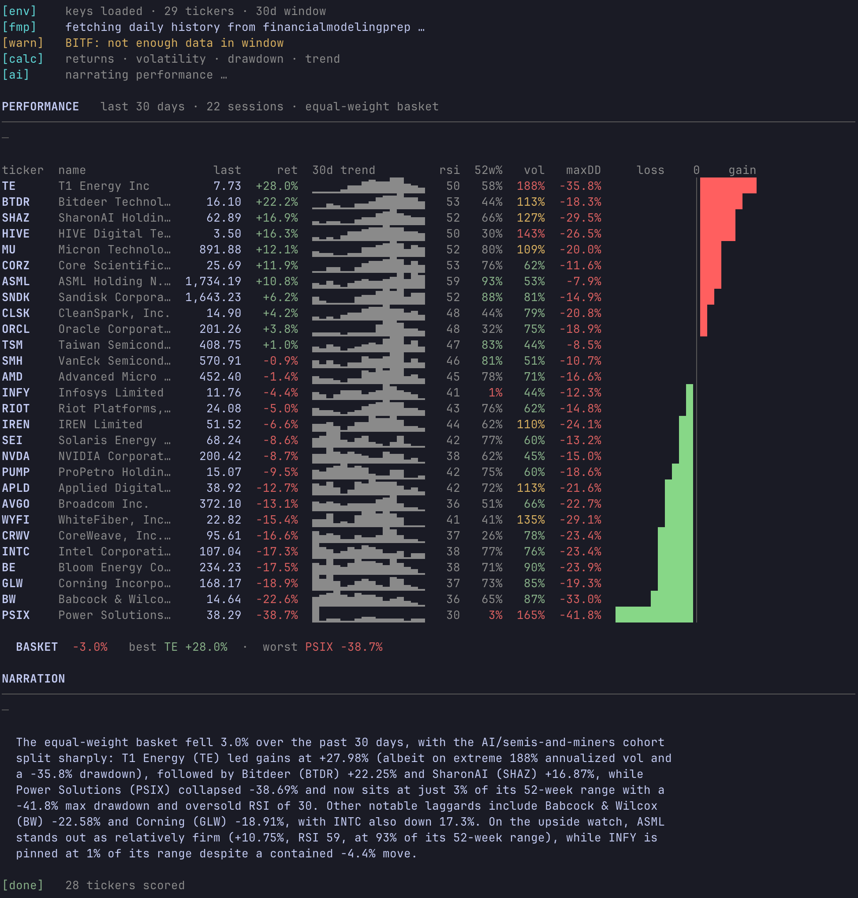

# Example: a stock-performance CLI

`finterm` is a small command-line tool built with the **terminal-report** skill.
You give it tickers and a lookback window; it pulls daily prices, computes
per-ticker and basket metrics, and prints a polished report — then asks Claude
for a short narration. It's a separate project (a *consumer* of the skill), shown
here to demonstrate what the skill produces in a real tool.

Below: the full 13F book of **Situational Awareness LP** (Leopold Aschenbrenner's
fund), 29 positions resolved from their latest SEC filing, over a 30-day window.



## What you're looking at (every element comes from the skill)

- **Tagged progress log** — `[env] [fmp] [warn] [calc] [ai] [done]`. The `[warn]`
  line shows graceful degradation: a ticker with too little data is skipped, not
  fatal (29 requested → 28 scored).
- **Section header** — `PERFORMANCE` with a muted subtitle and a rule.
- **Aligned table** — right-aligned numerics, left-aligned labels, sorted by
  return. Columns: `last`, `ret` (green up / red down), a **sparkline** trend,
  `rsi` (red ≥70 overbought, green ≤30 oversold), `52w%` (green near highs, red
  near lows), `vol` (green→amber→red scale), `maxDD`.
- **Diverging bars** — each name's return relative to the basket, fanning green
  to the right and red to the left of a zero axis. The signature visual.
- **Basket summary + Claude narration** — an equal-weight roll-up, then a 2–4
  sentence read of the period that uses the actual numbers.

## The command

```bash
cd ~/code/personal/finterm
uv run finterm.py SMH,NVDA,SNDK,ORCL,MU,AVGO,AMD,BE,TSM,CRWV,ASML,IREN,CORZ,APLD,INTC,RIOT,CLSK,SEI,TE,BITF,BTDR,PSIX,GLW,WYFI,BW,SHAZ,PUMP,INFY,HIVE 30d
```

Tickers are ordered by reported 13F position size (largest first). Swap the
window for `90d`, `100d`, or `252d`.

## How the ticker list was derived

The positions came straight from SEC EDGAR — Situational Awareness LP
(CIK 2045724), 13F-HR filed 2026-05-18 (holdings as of 2026-03-31). The filing's
information table lists 42 line items by CUSIP; collapsing put/call/multi-lot
variants to unique underlyings gives 29 securities, each CUSIP resolved to a
ticker.

**Caveats worth keeping in mind:** a 13F is a quarter-old snapshot of US-listed
long equity and options only — no shorts, cash, or direction. Several of these
names were held (wholly or partly) as **puts** (e.g. NVDA, ORCL, AVGO, AMD, MU,
TSM, ASML, INTC), so the table shows each underlying's price move, **not** the
fund's P&L or whether they were long or short it. The largest reported line,
SMH (the semiconductor ETF), was a put.

## Run it for the screenshot

Color only shows in a real terminal (it auto-disables when piped). Run the
command in your terminal, widen the window so the table doesn't wrap, and
capture it.
