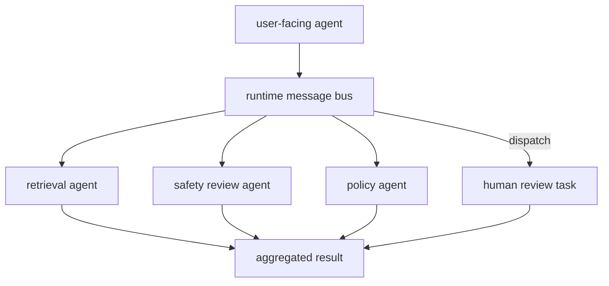
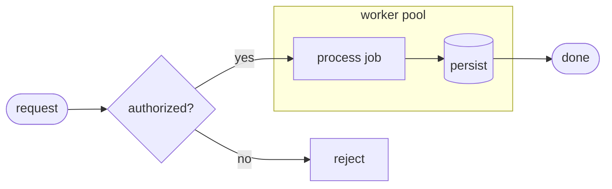
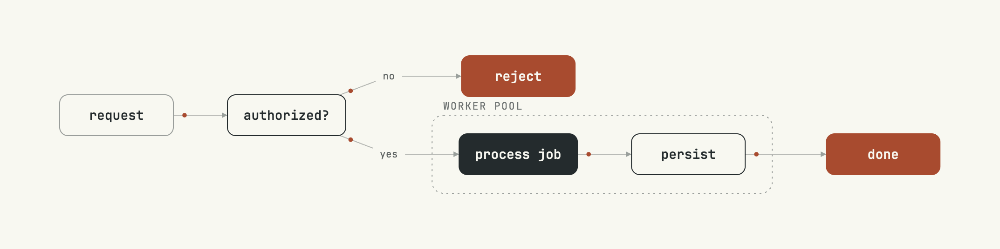
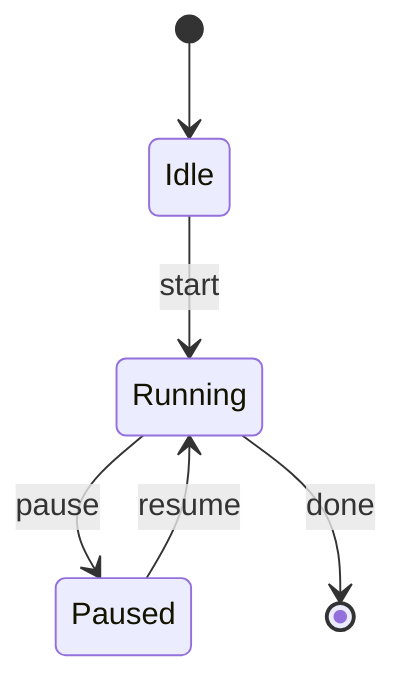
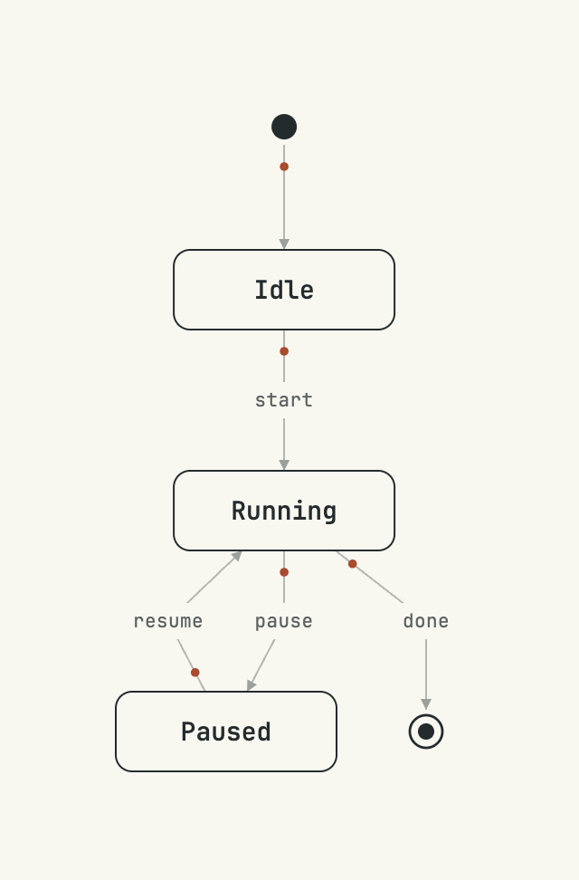
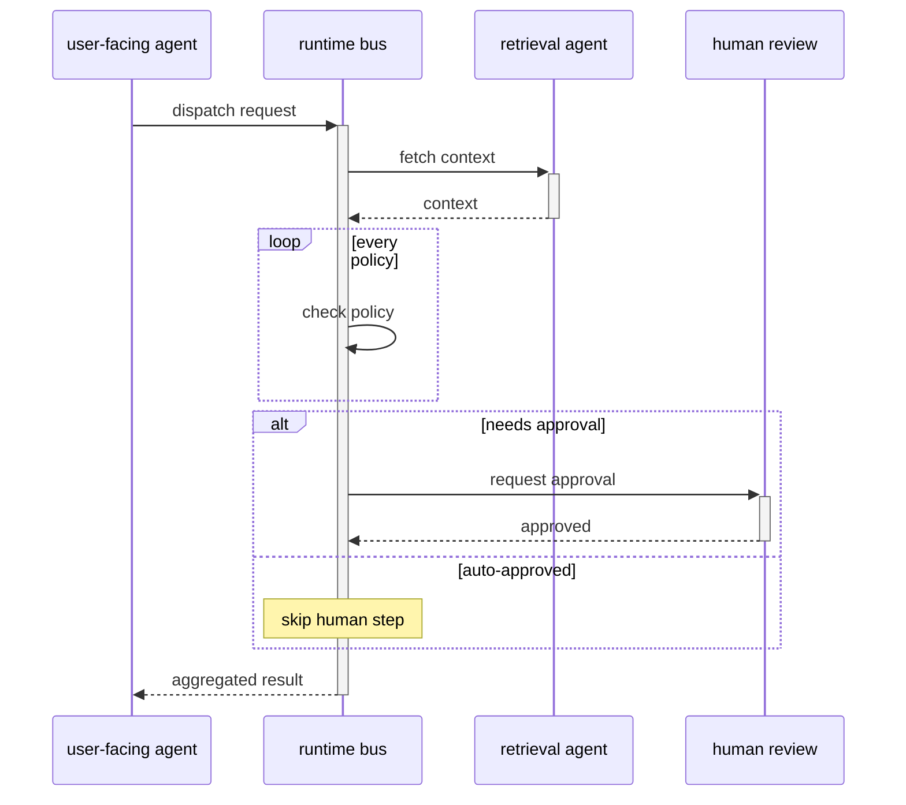
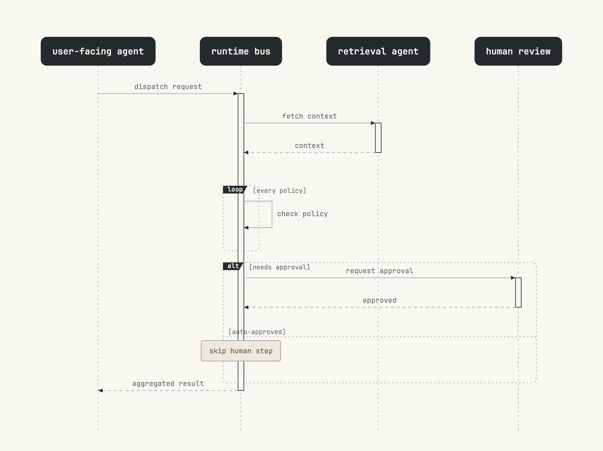

# mermaid-render — gallery

Each diagram below is the rendered output of the Mermaid source beside it, using
the skill's default theme. Images are the static PNG; every example also produces
an **animated** SVG (a slow accent packet travels each arrow) — the `.svg` files
live in [`images/mermaid-render/`](images/mermaid-render/).

Source files: [`skills/mermaid-render/examples/`](../../skills/mermaid-render/examples/).
Render any of them with:

```bash
bun run skills/mermaid-render/scripts/render.ts -i skills/mermaid-render/examples/flowchart.mmd -o out
```

---

## Flowchart — role-coded nodes

Classes (`:::hub`, `:::accent`, `:::human`, `:::entry`) pick the styling; the
`dispatch` edge label and the fan-out into and out of the bus are stock Mermaid.




---

## Flowchart — clusters, a decision, left-to-right

`subgraph` becomes a labelled container, `{authorized?}` a decision, and
`flowchart LR` flips the layout. Nodes mentioned inside the subgraph join it.





---

## State diagram

`[*]` renders as a filled start dot and a ringed final state; transitions carry
their `: label`.





---

## Sequence diagram

Participants, activation bars, a self-message, `loop` / `alt` / `else` fragment
frames, a note, and dashed replies — each message also carries an animated packet
in the SVG.




