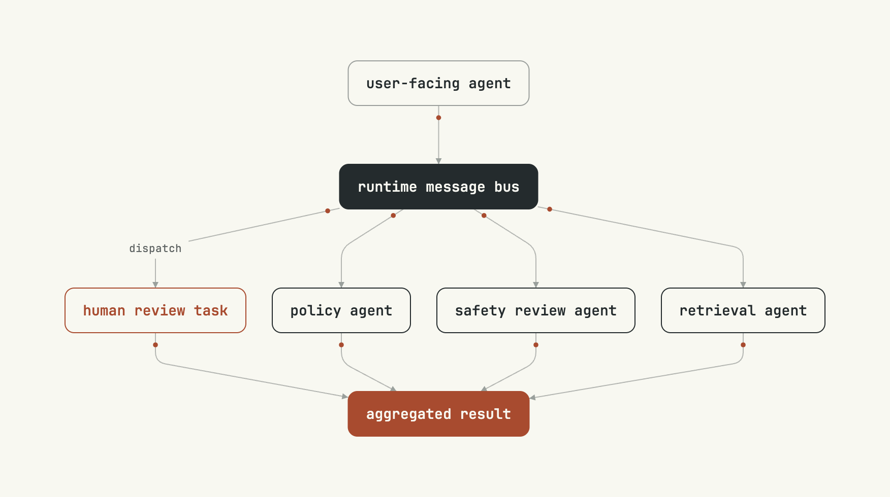

# mermaid-render

Turn a **Mermaid** diagram into a beautiful, optionally **animated** SVG (and a
high-resolution PNG) in a calm editorial style — instead of stock Mermaid output.
It parses the Mermaid yourself-write, lays it out with the same engine Mermaid
uses (`dagre`), and renders its own SVG so every pixel — colors, type, shapes,
borders, motion — comes from **one config file** you control.



Three diagram families are supported, each auto-detected from the source:

- **flowchart** (`graph` / `flowchart`)
- **stateDiagram** (`stateDiagram` / `stateDiagram-v2`)
- **sequenceDiagram**

See the [gallery](examples/mermaid-render.md) for state and sequence output, and
the skill's [`references/syntax-support.md`](../skills/mermaid-render/references/syntax-support.md)
for the exact supported Mermaid subset.

## When it triggers

Whenever you want a diagram that looks good rather than generic:

- "render / draw / make a diagram of this flow (or sequence, or state machine)"
- "beautify / restyle this Mermaid diagram"
- "add animated data-flow to this diagram"
- "turn this architecture (or process) into a diagram for the README / slide"

It stays out of the way of adjacent work: it is **not** a live Mermaid plugin, not
a TUI, and not a general drawing tool. It renders flowchart / state / sequence
diagrams; other Mermaid types (gantt, ER, class, pie, …) are out of scope.

## Using it

Nothing to install or wire up. The one runtime dependency — `@dagrejs/dagre`, the
layout engine — auto-installs on first render (Bun installs it on demand; under
Node it's fetched once). Scripts run with `bun` or `npx tsx`.

### Render an SVG

```bash
# from a file
bun run skills/mermaid-render/scripts/render.ts --input diagram.mmd --output diagram

# or inline
bun run skills/mermaid-render/scripts/render.ts --code "graph TD; A-->B" --output diagram

# static (no motion)
bun run skills/mermaid-render/scripts/render.ts -i diagram.mmd -o diagram --no-anim
```

This writes `diagram.svg`. **The SVG is the primary deliverable** — it's animated,
infinitely scalable, and a few KB. For docs and READMEs, reference the `.svg`.

| flag | meaning |
|---|---|
| `-i, --input <file>` | Mermaid source file |
| `-c, --code <str>` | Mermaid source inline |
| `-o, --output <name>` | output base name → `<name>.svg` |
| `--config <file>` | a custom theme module (see [Styling](#styling-and-roles)) |
| `--type <t>` | force `flowchart` \| `state` \| `sequence` (skip auto-detect) |
| `--no-anim` | render a static SVG (no travelling packets) |

### Capture a PNG (optional)

For a raster fallback, wrap the SVG and screenshot it with a headless browser
(the [`agent-browser`](https://www.npmjs.com/package/agent-browser) CLI, or any
Playwright/Puppeteer setup):

```bash
bun run skills/mermaid-render/scripts/create-html.ts --svg diagram.svg --output diagram.html --scale 2
agent-browser set viewport 2600 1600
agent-browser open "file://$(pwd)/diagram.html"
agent-browser wait 700
agent-browser screenshot ".container" diagram.png
agent-browser close
```

The wrapper hides the moving packets so the PNG is a clean static frame (pass
`--animated` to keep them). Bump `--scale` for crisper output on dense diagrams.
Delete the `.html` afterward — keep only `.svg` (and `.png`).

## Styling and roles

The look is **role-coded**: a node's style comes from a **class name**, not from
its Mermaid shape. Assign one with `:::name` (or `class A,B name`):

```
flowchart TD
  U["user-facing agent"]:::entry --> BUS["runtime message bus"]:::hub
  BUS -->|dispatch| H["human review task"]:::human
  H --> AGG["aggregated result"]:::accent
```

The shipped theme defines six classes:

| class | look | use for |
|---|---|---|
| `default` | thin ink outline | ordinary nodes |
| `entry` | soft grey outline | external inputs |
| `hub` | solid ink, light text | orchestrators / buses |
| `accent` | solid accent, light text | outputs / results |
| `human` | accent outline | human-in-the-loop |
| `temp` | dashed outline | temporary / ephemeral |

Unknown class names fall back to `default`. Two-line labels work via `<br>`
(first line = title, rest = subtitle). Flowchart shapes (`{}`, `()`, `([])`, …)
are intentionally normalised to one panel style for a consistent look — convey
role with a class, not a shape.

## Configuring

Everything visual lives in **`skills/mermaid-render/config.ts`** as a single
`theme` object — there is no hard-coded style in the renderers. To reskin, either
edit that file, or copy it, change it, and point a render at it:

```bash
bun run skills/mermaid-render/scripts/render.ts -i diagram.mmd -o out --config ./my-theme.ts
```

The theme is organised into sections:

| section | controls |
|---|---|
| `font` | family, title/subtitle sizes, weight, and the monospace width heuristic |
| `colors` | `paper`, `ink`, `accent`, plus derived line/arrow/label greys |
| `node` | corner radius, border width, padding, heights, text baselines |
| `variants` | the class → style map (`fill` / `border` / `title` / `sub` / `dash`) |
| `edge` | line width, bend rounding, arrowhead size, edge-label pill |
| `layout` | default direction and dagre spacing (rank/node/edge separation, margins) |
| `animation` | `enabled`, packet/dot radii, speed, duration clamp, stagger |
| `cluster` | subgraph / composite-state container styling |
| `state` | start-dot / final-ring sizes |
| `sequence` | participant, lifeline, activation, note, and fragment styling |

A few common edits:

```ts
// recolour everything — change the three anchors near the top of config.ts
const paper = "#F8F8F1";   // background
const ink   = "#242B2D";   // text + strong fills
const accent = "#A84B2F";  // the "data" colour (dots, packets, accent nodes)

// turn motion off by default
animation: { enabled: false, /* … */ }

// add your own role
variants: {
  // …
  danger: { fill: "#7a2222", border: "#7a2222", title: "#F8F8F1", sub: "#e9c9c9" },
}
// then reference it in Mermaid:  X["rollback"]:::danger
```

Switch to a proportional (non-monospace) font? Also tune `font.charWidth` and
`node.padX` so boxes still fit their text.

## Animation

On by default. Each edge (and each sequence message) carries a slow accent
"packet" plus a static port dot — it reads as data flowing in the arrow's
direction. It's **progressive enhancement**:

- the diagram is fully legible when static,
- it respects `prefers-reduced-motion: reduce`,
- the PNG fallback hides the moving packets (clean port dots only).

Disable per-render with `--no-anim`, or globally with `animation.enabled: false`.

> **Rendering note.** The animation uses inline SVG SMIL, which plays in
> browsers, VS Code's Markdown preview, and most static-site renderers. GitHub's
> Markdown viewer sometimes strips SMIL from ``-loaded SVGs — there it falls
> back gracefully to the static styled diagram. Embed the PNG if you need
> guaranteed pixels everywhere, or the SVG if you want the motion.

## Notes and limits

- One diagram per file.
- Auto-detect reads the first non-comment line; override with `--type`.
- Long labels aren't word-wrapped — use `<br>` to break, or quote labels with
  special characters: `A["a / b (c)"]`.
- Supported Mermaid is a **common subset** per type; the full list (and what's
  skipped) is in the skill's
  [`references/syntax-support.md`](../skills/mermaid-render/references/syntax-support.md).

More renders, with their source, in the [gallery](examples/mermaid-render.md).
